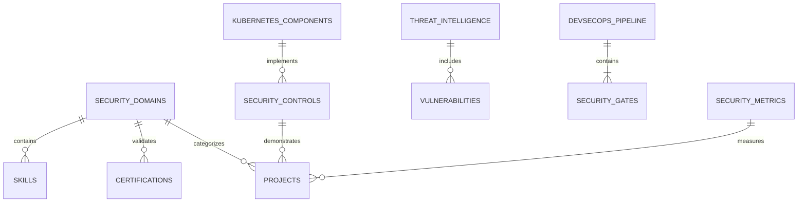

# Security Portfolio Mock Data Specification

This document defines the data structures and mock data examples needed to power our security portfolio visualizations and components. It serves as a reference for developing data hooks, D3.js visualizations, and integration points with the existing portfolio.

## Data Structure Overview



## Core Data Structures

### 1. Security Domains & Skills

This data powers the SecurityRadarChart and skills matrix components.

```javascript
const securityDomains = [
  {
    id: "app-sec",
    name: "Application Security",
    icon: "shield-check",
    color: "#4f46e5", // indigo-600
    description: "Securing applications through secure coding practices, SAST/DAST, and runtime protection",
    frameworks: ["OWASP SAMM", "NIST SP 800-218"],
    skills: [
      { id: "secure-coding", name: "Secure Coding", level: 90 },
      { id: "sast", name: "Static Analysis", level: 85 },
      { id: "dast", name: "Dynamic Analysis", level: 80 },
      { id: "api-security", name: "API Security", level: 95 },
      { id: "dependency-mgmt", name: "Dependency Management", level: 85 }
    ]
  },
  {
    id: "cloud-sec",
    name: "Cloud Security",
    icon: "cloud-shield",
    color: "#0891b2", // cyan-600
    description: "Securing cloud infrastructure and applications in AWS, GCP, and Azure environments",
    frameworks: ["AWS Well-Architected", "NIST SP 800-204"],
    skills: [
      { id: "iam", name: "Identity & Access Management", level: 90 },
      { id: "cspm", name: "Cloud Security Posture Management", level: 85 },
      { id: "data-protection", name: "Data Protection", level: 80 },
      { id: "serverless-security", name: "Serverless Security", level: 75 },
      { id: "network-security", name: "Cloud Network Security", level: 85 }
    ]
  },
  {
    id: "k8s-sec",
    name: "Kubernetes Security",
    icon: "kubernetes",
    color: "#0284c7", // sky-600
    description: "Securing Kubernetes clusters, workloads, and the container ecosystem",
    frameworks: ["CIS Benchmarks", "NIST SP 800-190"],
    skills: [
      { id: "cluster-hardening", name: "Cluster Hardening", level: 95 },
      { id: "pod-security", name: "Pod Security", level: 90 },
      { id: "network-policies", name: "Network Policies", level: 85 },
      { id: "service-mesh", name: "Service Mesh Security", level: 80 },
      { id: "secrets-mgmt", name: "Secrets Management", level: 85 }
    ]
  },
  {
    id: "devsecops",
    name: "DevSecOps",
    icon: "git-merge",
    color: "#c026d3", // fuchsia-600
    description: "Integrating security throughout the CI/CD pipeline and software development lifecycle",
    frameworks: ["DevSecOps Maturity Model", "NIST SP 800-204A"],
    skills: [
      { id: "pipeline-security", name: "Pipeline Security", level: 90 },
      { id: "iac-security", name: "Infrastructure as Code Security", level: 95 },
      { id: "artifact-scanning", name: "Container/Artifact Scanning", level: 85 },
      { id: "compliance-as-code", name: "Compliance as Code", level: 80 },
      { id: "security-testing", name: "Automated Security Testing", level: 90 }
    ]
  },
  {
    id: "sec-arch",
    name: "Security Architecture",
    icon: "template",
    color: "#ea580c", // orange-600
    description: "Designing secure systems with a focus on defense in depth and zero trust principles",
    frameworks: ["SABSA", "TOGAF"],
    skills: [
      { id: "zero-trust", name: "Zero Trust Architecture", level: 85 },
      { id: "threat-modeling", name: "Threat Modeling", level: 90 },
      { id: "security-patterns", name: "Security Design Patterns", level: 85 },
      { id: "defense-in-depth", name: "Defense in Depth", level: 80 },
      { id: "secure-sdlc", name: "Secure SDLC", level: 90 }
    ]
  }
];
```

### 2. Security Certifications

Powers the certification badges and expertise showcase.

```javascript
const securityCertifications = [
  {
    id: "cissp",
    name: "CISSP",
    fullName: "Certified Information Systems Security Professional",
    issuer: "ISC²",
    issueDate: "2022-03-15",
    expiryDate: "2025-03-15",
    logo: "/images/certifications/cissp.png",
    domains: ["app-sec", "cloud-sec", "sec-arch"],
    verificationUrl: "https://www.youracclaim.com/badges/cissp/verify",
    level: "Professional"
  },
  {
    id: "cka",
    name: "CKA",
    fullName: "Certified Kubernetes Administrator",
    issuer: "Cloud Native Computing Foundation",
    issueDate: "2021-11-10",
    expiryDate: "2024-11-10",
    logo: "/images/certifications/cka.png",
    domains: ["k8s-sec"],
    verificationUrl: "https://www.youracclaim.com/badges/cka/verify",
    level: "Professional"
  },
  {
    id: "ckad",
    name: "CKAD",
    fullName: "Certified Kubernetes Application Developer",
    issuer: "Cloud Native Computing Foundation",
    issueDate: "2021-09-05",
    expiryDate: "2024-09-05",
    logo: "/images/certifications/ckad.png",
    domains: ["k8s-sec"],
    verificationUrl: "https://www.youracclaim.com/badges/ckad/verify",
    level: "Professional"
  },
  {
    id: "cks",
    name: "CKS",
    fullName: "Certified Kubernetes Security Specialist",
    issuer: "Cloud Native Computing Foundation",
    issueDate: "2022-05-20",
    expiryDate: "2025-05-20",
    logo: "/images/certifications/cks.png",
    domains: ["k8s-sec", "app-sec"],
    verificationUrl: "https://www.youracclaim.com/badges/cks/verify",
    level: "Expert"
  },
  {
    id: "aws-security",
    name: "AWS Security Specialty",
    fullName: "AWS Certified Security - Specialty",
    issuer: "Amazon Web Services",
    issueDate: "2023-01-17",
    expiryDate: "2026-01-17",
    logo: "/images/certifications/aws-security.png",
    domains: ["cloud-sec"],
    verificationUrl: "https://www.youracclaim.com/badges/aws-security/verify",
    level: "Specialty"
  },
  {
    id: "gcp-security",
    name: "Google Cloud Security",
    fullName: "Google Cloud Professional Cloud Security Engineer",
    issuer: "Google Cloud",
    issueDate: "2023-04-30",
    expiryDate: "2026-04-30",
    logo: "/images/certifications/gcp-security.png",
    domains: ["cloud-sec"],
    verificationUrl: "https://www.credential.net/verify",
    level: "Professional"
  }
];
```

### 3. Kubernetes Security Architecture

Powers the Kubernetes architecture explorer and component visuals.

```javascript
const kubernetesArchitecture = {
  clusterComponents: [
    {
      id: "control-plane",
      name: "Control Plane",
      type: "component-group",
      description: "Kubernetes control plane components",
      securityControls: ["rbac", "encryption", "audit-logging"],
      children: [
        {
          id: "api-server",
          name: "API Server",
          type: "component",
          description: "Kubernetes API Server - the frontend for the control plane",
          securityControls: ["auth-modes", "admission-controllers", "tls"],
          vulnerabilities: ["privilege-escalation", "unauthorized-access"]
        },
        {
          id: "etcd",
          name: "etcd",
          type: "component",
          description: "Consistent and highly-available key-value store",
          securityControls: ["encryption-at-rest", "tls", "auth"],
          vulnerabilities: ["data-exposure", "unauthorized-access"]
        },
        {
          id: "scheduler",
          name: "Scheduler",
          type: "component",
          description: "Component that assigns pods to nodes",
          securityControls: ["rbac"],
          vulnerabilities: ["denial-of-service"]
        },
        {
          id: "controller-manager",
          name: "Controller Manager",
          type: "component",
          description: "Runs controller processes",
          securityControls: ["rbac"],
          vulnerabilities: ["denial-of-service"]
        }
      ]
    },
    {
      id: "worker-nodes",
      name: "Worker Nodes",
      type: "component-group",
      description: "Kubernetes worker node components",
      securityControls: ["node-hardening", "cis-benchmark"],
      children: [
        {
          id: "kubelet",
          name: "Kubelet",
          type: "component",
          description: "Agent that runs on each node",
          securityControls: ["tls", "auth"],
          vulnerabilities: ["container-escape", "privilege-escalation"]
        },
        {
          id: "container-runtime",
          name: "Container Runtime",
          type: "component",
          description: "Software responsible for running containers",
          securityControls: ["seccomp", "apparmor", "selinux"],
          vulnerabilities: ["container-escape", "privilege-escalation"]
        },
        {
          id: "kube-proxy",
          name: "Kube Proxy",
          type: "component",
          description: "Network proxy that runs on each node",
          securityControls: ["network-policy"],
          vulnerabilities: ["network-attack"]
        }
      ]
    },
    {
      id: "workloads",
      name: "Workloads",
      type: "component-group",
      description: "Kubernetes workload resources",
      securityControls: ["pod-security-standards", "network-policies"],
      children: [
        {
          id: "pods",
          name: "Pods",
          type: "resource",
          description: "Smallest deployable units in Kubernetes",
          securityControls: ["security-context", "pod-security-standards"],
          vulnerabilities: ["privilege-escalation", "resource-exhaustion"]
        },
        {
          id: "deployments",
          name: "Deployments",
          type: "resource",
          description: "Provides declarative updates for Pods and ReplicaSets",
          securityControls: ["rbac"],
          vulnerabilities: ["misconfiguration"]
        },
        {
          id: "services",
          name: "Services",
          type: "resource",
          description: "An abstract way to expose applications running on pods",
          securityControls: ["network-policies"],
          vulnerabilities: ["network-exposure"]
        }
      ]
    },
    {
      id: "security-components",
      name: "Security Components",
      type: "component-group",
      description: "Additional security components for Kubernetes",
      securityControls: ["defense-in-depth"],
      children: [
        {
          id: "admission-controllers",
          name: "Admission Controllers",
          type: "component",
          description: "Intercepts requests to the Kubernetes API server",
          securityControls: ["policy-enforcement", "validation"],
          vulnerabilities: ["bypass"]
        },
        {
          id: "policy-engine",
          name: "Policy Engine",
          type: "component",
          description: "Enforces policies across the cluster",
          securityControls: ["opa", "kyverno"],
          vulnerabilities: ["misconfiguration"]
        },
        {
          id: "service-mesh",
          name: "Service Mesh",
          type: "component",
          description: "Network infrastructure layer for service-to-service communication",
          securityControls: ["mtls", "authorization"],
          vulnerabilities: ["bypass", "misconfiguration"]
        }
      ]
    }
  ],
  securityControls: [
    {
      id: "rbac",
      name: "RBAC",
      fullName: "Role-Based Access Control",
      description: "Regulates access to resources based on the roles of users",
      effectiveness: 85,
      type: "preventive",
      implementation: "Built-in Kubernetes feature",
      bestPractices: [
        "Follow principle of least privilege",
        "Use RoleBindings instead of ClusterRoleBindings when possible",
        "Regularly audit RBAC permissions"
      ],
      resources: [
        {
          name: "Role",
          example: `kind: Role
apiVersion: rbac.authorization.k8s.io/v1
metadata:
  namespace: default
  name: pod-reader
rules:
- apiGroups: [""]
  resources: ["pods"]
  verbs: ["get", "watch", "list"]`
        },
        {
          name: "RoleBinding",
          example: `kind: RoleBinding
apiVersion: rbac.authorization.k8s.io/v1
metadata:
  name: read-pods
  namespace: default
subjects:
- kind: User
  name: alice
roleRef:
  kind: Role
  name: pod-reader
  apiGroup: rbac.authorization.k8s.io`
        }
      ]
    },
    {
      id: "network-policies",
      name: "Network Policies",
      fullName: "Kubernetes Network Policies",
      description: "Specifications of how groups of pods are allowed to communicate",
      effectiveness: 80,
      type: "preventive",
      implementation: "Kubernetes resource with CNI plugin support",
      bestPractices: [
        "Deny all traffic by default",
        "Allow only necessary communications",
        "Label pods consistently for policy targeting"
      ],
      resources: [
        {
          name: "NetworkPolicy",
          example: `apiVersion: networking.k8s.io/v1
kind: NetworkPolicy
metadata:
  name: default-deny-all
spec:
  podSelector: {}
  policyTypes:
  - Ingress
  - Egress`
        }
      ]
    },
    {
      id: "pod-security-standards",
      name: "Pod Security Standards",
      fullName: "Kubernetes Pod Security Standards",
      description: "Defines different isolation levels for Pods",
      effectiveness: 90,
      type: "preventive",
      implementation: "Pod Security Admission Controller or 3rd party tools",
      bestPractices: [
        "Use Restricted profile for most workloads",
        "Apply standards at namespace level",
        "Consider exceptions only when necessary"
      ],
      resources: [
        {
          name: "Pod Security Admission",
          example: `apiVersion: v1
kind: Namespace
metadata:
  name: secure-namespace
  labels:
    pod-security.kubernetes.io/enforce: restricted
    pod-security.kubernetes.io/audit: restricted
    pod-security.kubernetes.io/warn: restricted`
        }
      ]
    }
  ],
  connections: [
    { source: "api-server", target: "etcd", type: "communicates-with" },
    { source: "api-server", target: "scheduler", type: "communicates-with" },
    { source: "api-server", target: "controller-manager", type: "communicates-with" },
    { source: "api-server", target: "kubelet", type: "communicates-with" },
    { source: "kubelet", target: "container-runtime", type: "uses" },
    { source: "kubelet", target: "pods", type: "manages" },
    { source: "kube-proxy", target: "services", type: "configures" },
    { source: "api-server", target: "admission-controllers", type: "uses" },
    { source: "admission-controllers", target: "policy-engine", type: "uses" },
    { source: "pods", target: "service-mesh", type: "protected-by" }
  ]
};
```

### 4. Security Projects

Powers the project gallery with security-focused case studies.

```javascript
const securityProjects = [
  {
    id: "zero-trust-k8s",
    title: "Zero Trust Architecture for Kubernetes",
    description: "Implemented a comprehensive zero trust architecture for multi-tenant Kubernetes clusters",
    domains: ["k8s-sec", "cloud-sec", "sec-arch"],
    thumbnail: "/images/projects/zero-trust-k8s.png",
    featured: true,
    startDate: "2023-06-01",
    endDate: "2023-09-15",
    client: "Financial Services Company",
    problem: "Multi-tenant Kubernetes clusters with strict regulatory requirements needed enhanced security controls",
    solution: "Designed and implemented a zero trust architecture with service mesh, admission controllers, and runtime security",
    implementation: [
      {
        name: "Service Mesh",
        details: "Implemented Istio service mesh with mTLS for all service-to-service communication",
        technologies: ["Istio", "Envoy", "cert-manager"]
      },
      {
        name: "Admission Control",
        details: "Deployed OPA Gatekeeper for policy enforcement across all workloads",
        technologies: ["OPA", "Gatekeeper", "Rego"]
      },
      {
        name: "Runtime Security",
        details: "Integrated Falco for runtime threat detection with custom rules",
        technologies: ["Falco", "eBPF", "Sysdig"]
      }
    ],
    results: [
      "Achieved 100% mTLS encryption for all internal traffic",
      "Reduced attack surface by 75% through strict network policies",
      "Implemented 85 security policies enforced through admission control",
      "Detected and prevented 12 potential security incidents in first month"
    ],
    codeExamples: [
      {
        title: "Istio Authorization Policy",
        language: "yaml",
        code: `apiVersion: security.istio.io/v1beta1
kind: AuthorizationPolicy
metadata:
  name: frontend-ingress
  namespace: application
spec:
  selector:
    matchLabels:
      app: frontend
  action: ALLOW
  rules:
  - from:
    - source:
        namespaces: ["ingress-system"]
    to:
    - operation:
        methods: ["GET"]`
      },
      {
        title: "OPA Constraint Template",
        language: "yaml",
        code: `apiVersion: templates.gatekeeper.sh/v1
kind: ConstraintTemplate
metadata:
  name: k8srequiredlabels
spec:
  crd:
    spec:
      names:
        kind: K8sRequiredLabels
      validation:
        openAPIV3Schema:
          properties:
            labels:
              type: array
              items: string
  targets:
    - target: admission.k8s.gatekeeper.sh
      rego: |
        package k8srequiredlabels
        violation[{"msg": msg, "details": {"missing_labels": missing}}] {
          provided := {label | input.review.object.metadata.labels[label]}
          required := {label | label := input.parameters.labels[_]}
          missing := required - provided
          count(missing) > 0
          msg := sprintf("Missing required labels: %v", [missing])
        }`
      }
    ],
    architecture: {
      diagram: "/images/projects/zero-trust-architecture.svg",
      components: [
        "API Gateway",
        "Service Mesh",
        "Admission Controllers",
        "Runtime Security",
        "Secrets Management",
        "Network Policies"
      ]
    },
    metrics: {
      securityPosture: 95,
      vulnerabilitiesAddressed: 24,
      complianceScore: 98,
      implementationTime: "14 weeks"
    }
  },
  {
    id: "devsecops-pipeline",
    title: "DevSecOps Pipeline Integration",
    description: "Built a comprehensive DevSecOps pipeline with security gates at each stage",
    domains: ["devsecops", "app-sec"],
    thumbnail: "/images/projects/devsecops-pipeline.png",
    featured: true,
    startDate: "2022-11-15",
    endDate: "2023-03-10",
    client: "Healthcare Technology Startup",
    problem: "Development pipeline lacked security controls, resulting in vulnerabilities being discovered late in the cycle",
    solution: "Designed and implemented a complete DevSecOps pipeline with automated security checks at every stage",
    implementation: [
      {
        name: "Code Security",
        details: "Integrated SAST tools with pre-commit hooks and CI pipeline",
        technologies: ["SonarQube", "Semgrep", "GitLeaks"]
      },
      {
        name: "Build Security",
        details: "Implemented artifact scanning for dependencies and container images",
        technologies: ["Trivy", "OWASP Dependency Check", "Grype"]
      },
      {
        name: "Deployment Security",
        details: "Automated IaC scanning and compliance verification",
        technologies: ["Checkov", "TFSec", "OPA Conftest"]
      }
    ],
    results: [
      "Reduced vulnerability remediation time by 65%",
      "Identified and fixed 138 security issues before production deployment",
      "Achieved 100% policy compliance for all infrastructure as code",
      "Reduced security review time from 5 days to 2 hours per release"
    ],
    codeExamples: [
      {
        title: "GitHub Actions Pipeline",
        language: "yaml",
        code: `name: DevSecOps Pipeline

on:
  push:
    branches: [ main ]
  pull_request:
    branches: [ main ]
    
jobs:
  security-scan:
    runs-on: ubuntu-latest
    steps:
      - uses: actions/checkout@v3
      
      - name: Secret Scanning
        uses: gitleaks/gitleaks-action@v2
      
      - name: SAST
        uses: SonarSource/sonarcloud-github-action@v1.8
        
      - name: Dependency Check
        uses: dependency-check/Dependency-Check_Action@main
        with:
          project: 'healthcare-app'
          path: '.'
          format: 'HTML'
          out: 'reports'`
      }
    ],
    architecture: {
      diagram: "/images/projects/devsecops-pipeline.svg",
      components: [
        "Source Code Management",
        "Static Analysis",
        "Dependency Scanning",
        "Container Scanning",
        "Infrastructure as Code Scanning",
        "Dynamic Analysis",
        "Compliance Verification"
      ]
    },
    metrics: {
      vulnerabilitiesPreventedPerSprint: 18,
      meanTimeToRemediate: "2.5 days",
      securityGatePassRate: 94,
      automationCoverage: 92
    }
  }
];
```

### 5. DevSecOps Pipeline

Powers the pipeline visualization component.

```javascript
const devSecOpsPipeline = {
  name: "DevSecOps Pipeline",
  description: "Comprehensive security integration throughout the development lifecycle",
  stages: [
    {
      id: "code",
      name: "Code",
      description: "Writing and committing code",
      order: 1,
      securityGates: [
        {
          id: "secret-scanning",
          name: "Secret Scanning",
          description: "Detect and prevent secrets from being committed",
          tool: "GitLeaks",
          effectiveness: 90,
          automationLevel: "Fully Automated",
          implementationDetails: "Pre-commit hooks and GitHub Actions integration"
        },
        {
          id: "sast",
          name: "Static Analysis",
          description: "Identify security vulnerabilities in code",
          tool: "SonarQube + Semgrep",
          effectiveness: 85,
          automationLevel: "Fully Automated",
          implementationDetails: "Integrated in CI pipeline with quality gates"
        }
      ]
    },
    {
      id: "build",
      name: "Build",
      description: "Compiling code and building artifacts",
      order: 2,
      securityGates: [
        {
          id: "dependency-check",
          name: "Dependency Scanning",
          description: "Identify vulnerabilities in dependencies",
          tool: "OWASP Dependency Check",
          effectiveness: 92,
          automationLevel: "Fully Automated",
          implementationDetails: "Scans all dependencies with CVE database"
        },
        {
          id: "container-scan",
          name: "Container Scanning",
          description: "Identify vulnerabilities in container images",
          tool: "Trivy",
          effectiveness: 90,
          automationLevel: "Fully Automated",
          implementationDetails: "Scans base images and added layers"
        }
      ]
    },
    {
      id: "test",
      name: "Test",
      description: "Running tests on the application",
      order: 3,
      securityGates: [
        {
          id: "dast",
          name: "Dynamic Analysis",
          description: "Identify runtime vulnerabilities",
          tool: "OWASP ZAP",
          effectiveness: 80,
          automationLevel: "Semi-Automated",
          implementationDetails: "Baseline and full scans against test environment"
        },
        {
          id: "security-testing",
          name: "Security Unit Tests",
          description: "Test security controls and functions",
          tool: "JUnit + Custom Framework",
          effectiveness: 85,
          automationLevel: "Fully Automated",
          implementationDetails: "Security-specific test suite"
        }
      ]
    },
    {
      id: "deploy",
      name: "Deploy",
      description: "Deploying to production environment",
      order: 4,
      securityGates: [
        {
          id: "iac-scan",
          name: "Infrastructure as Code Scanning",
          description: "Identify misconfigurations in infrastructure",
          tool: "Checkov + TFSec",
          effectiveness: 88,
          automationLevel: "Fully Automated",
          implementationDetails: "Scans Terraform, CloudFormation, and Kubernetes manifests"
        },
        {
          id: "compliance-check",
          name: "Compliance Verification",
          description: "Verify compliance with policies",
          tool: "OPA Conftest",
          effectiveness: 95,
          automationLevel: "Fully Automated",
          implementationDetails: "Policy as code enforcing compliance requirements"
        }
      ]
    },
    {
      id: "operate",
      name: "Operate",
      description: "Running and monitoring in production",
      order: 5,
      securityGates: [
        {
          id: "runtime-protection",
          name: "Runtime Protection",
          description: "Detect and prevent attacks at runtime",
          tool: "Falco",
          effectiveness: 90,
          automationLevel: "Fully Automated",
          implementationDetails: "Kernel-level monitoring with custom rules"
        },
        {
          id: "security-monitoring",
          name: "Security Monitoring",
          description: "Continuous monitoring for security events",
          tool: "ELK Stack + Custom Dashboards",
          effectiveness: 85,
          automationLevel: "Semi-Automated",
          implementationDetails: "Centralized logging with security analytics"
        }
      ]
    }
  ],
  metrics: {
    timeToRemediate: {
      before: "12 days",
      after: "3 days",
      improvement: "75%"
    },
    vulnerabilitiesInProduction: {
      before: "32 per month",
      after: "4 per month",
      improvement: "87.5%"
    },
    securityCoverage: {
      before: "40%",
      after: "95%",
      improvement: "137.5%"
    },
    complianceVerification: {
      before: "Manual, 2 weeks",
      after: "Automated, 30 minutes",
      improvement: "99.5%"
    }
  }
};
```

### 6. Threat Intelligence Data

Powers the real-time security dashboard and GeoThreatMap.

```javascript
const threatIntelligence = {
  lastUpdated: "2025-03-06T12:30:00Z",
  summary: {
    activeThreatCount: 1243,
    criticalThreats: 78,
    highThreats: 245,
    mediumThreats: 589,
    lowThreats: 331,
    trendPercentage: +12.5
  },
  topAttackVectors: [
    { name: "SQL Injection", count: 342, percentage: 27.5 },
    { name: "Cross-Site Scripting", count: 287, percentage: 23.1 },
    { name: "Credential Stuffing", count: 204, percentage: 16.4 },
    { name: "API Abuse", count: 175, percentage: 14.1 },
    { name: "DDoS", count: 98, percentage: 7.9 }
  ],
  topAttackerCountries: [
    { country: "Unknown (Proxy/VPN)", count: 423, countryCode: "XX" },
    { country: "Russian Federation", count: 187, countryCode: "RU" },
    { country: "China", count: 156, countryCode: "CN" },
    { country: "United States", count: 98, countryCode: "US" },
    { country: "Brazil", count: 67, countryCode: "BR" }
  ],
  recentAttacks: [
    {
      id: "attack-1",
      timestamp: "2025-03-06T12:25:43Z",
      type: "SQL Injection",
      severity: "Critical",
      source: { ip: "103.45.67.89", country: "Unknown", countryCode: "XX" },
      target: { service: "User API", endpoint: "/api/users/search" },
      status: "Blocked",
      details: "Attempted SQLi in search parameter with payload: ' OR 1=1--"
    },
    {
      id: "attack-2",
      timestamp: "2025-03-06T12:20:15Z",
      type: "Cross-Site Scripting",
      severity: "High",
      source: { ip: "45.227.253.83", country: "Brazil", countryCode: "BR" },
      target: { service: "Comment System", endpoint: "/api/comments" },
      status: "Blocked",
      details: "XSS attempt in comment field with script injection"
    },
    {
      id: "attack-3",
      timestamp: "2025-03-06T12:18:32Z",
      type: "Credential Stuffing",
      severity: "Medium",
      source: { ip: "5.188.206.26", country: "Russian Federation", countryCode: "RU" },
      target: { service: "Authentication", endpoint: "/api/login" },
      status: "Blocked",
      details: "Multiple failed login attempts across different accounts (25+ in 30 seconds)"
    },
    {
      id: "attack-4",
      timestamp: "2025-03-06T12:15:07Z",
      type: "API Abuse",
      severity: "Medium",
      source: { ip: "167.94.138.60", country: "United States", countryCode: "US" },
      target: { service: "Product API", endpoint: "/api/products" },
      status: "Rate Limited",
      details: "Excessive API requests (500+ in 60 seconds) from single IP"
    },
    {
      id: "attack-5",
      timestamp: "2025-03-06T12:10:59Z",
      type: "Path Traversal",
      severity: "High", 
      source: { ip: "118.193.40.14", country: "China", countryCode: "CN" },
      target: { service: "File Service", endpoint: "/api/files/download" },
      status: "Blocked",
      details: "Attempted path traversal with payload: ../../../etc/passwd"
    }
  ],
  geoData: {
    attacks: [
      { source: { lat: 34.0522, lon: -118.2437 }, target: { lat: 40.7128, lon: -74.0060 }, count: 156, type: "SQL Injection" },
      { source: { lat: 39.9042, lon: 116.4074 }, target: { lat: 40.7128, lon: -74.0060 }, count: 128, type: "Brute Force" },
      { source: { lat: 55.7558, lon: 37.6173 }, target: { lat: 40.7128, lon: -74.0060 }, count: 93, type: "DDoS" },
      { source: { lat: -23.5505, lon: -46.6333 }, target: { lat: 40.7128, lon: -74.0060 }, count: 67, type: "XSS" },
      { source: { lat: 28.6139, lon: 77.2090 }, target: { lat: 40.7128, lon: -74.0060 }, count: 58, type: "SQL Injection" },
      { source: { lat: 51.5074, lon: -0.1278 }, target: { lat: 40.7128, lon: -74.0060 }, count: 42, type: "API Abuse" },
      { source: { lat: 1.3521, lon: 103.8198 }, target: { lat: 40.7128, lon: -74.0060 }, count: 37, type: "SSRF" },
      { source: { lat: 35.6762, lon: 139.6503 }, target: { lat: 40.7128, lon: -74.0060 }, count: 28, type: "XXE" }
    ],
    hotspots: [
      { lat: 40.7128, lon: -74.0060, intensity: 100, name: "Main Data Center" },
      { lat: 37.7749, lon: -122.4194, intensity: 65, name: "West Coast API" },
      { lat: 52.3676, lon: 4.9041, intensity: 45, name: "European CDN" },
      { lat: 1.3521, lon: 103.8198, intensity: 35, name: "APAC Services" }
    ]
  },
  timeSeriesData: [
    { timestamp: "2025-03-06T12:00:00Z", attackCount: 42, criticalCount: 3, highCount: 8, mediumCount: 19, lowCount: 12 },
    { timestamp: "2025-03-06T11:00:00Z", attackCount: 38, criticalCount: 2, highCount: 9, mediumCount: 14, lowCount: 13 },
    { timestamp: "2025-03-06T10:00:00Z", attackCount: 45, criticalCount: 4, highCount: 12, mediumCount: 18, lowCount: 11 },
    { timestamp: "2025-03-06T09:00:00Z", attackCount: 52, criticalCount: 5, highCount: 15, mediumCount: 21, lowCount: 11 },
    { timestamp: "2025-03-06T08:00:00Z", attackCount: 63, criticalCount: 6, highCount: 17, mediumCount: 25, lowCount: 15 },
    { timestamp: "2025-03-06T07:00:00Z", attackCount: 58, criticalCount: 4, highCount: 14, mediumCount: 22, lowCount: 18 },
    { timestamp: "2025-03-06T06:00:00Z", attackCount: 47, criticalCount: 3, highCount: 10, mediumCount: 19, lowCount: 15 },
    { timestamp: "2025-03-06T05:00:00Z", attackCount: 39, criticalCount: 2, highCount: 7, mediumCount: 18, lowCount: 12 },
    { timestamp: "2025-03-06T04:00:00Z", attackCount: 28, criticalCount: 1, highCount: 5, mediumCount: 12, lowCount: 10 },
    { timestamp: "2025-03-06T03:00:00Z", attackCount: 25, criticalCount: 0, highCount: 4, mediumCount: 9, lowCount: 12 },
    { timestamp: "2025-03-06T02:00:00Z", attackCount: 23, criticalCount: 1, highCount: 3, mediumCount: 8, lowCount: 11 },
    { timestamp: "2025-03-06T01:00:00Z", attackCount: 31, criticalCount: 2, highCount: 6, mediumCount: 10, lowCount: 13 }
  ]
};
