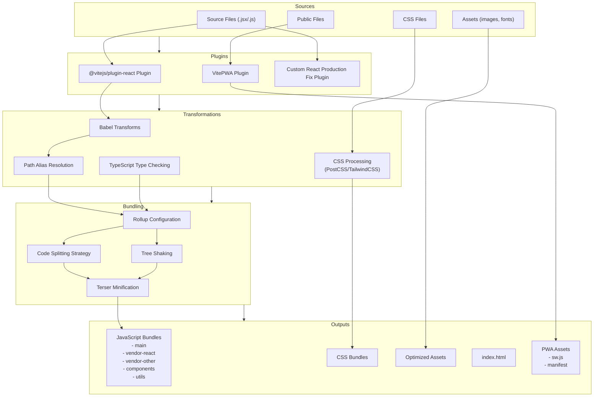
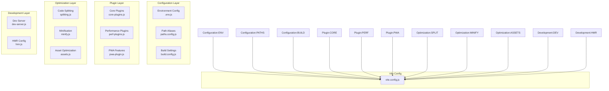

# Portfolio Build Process Analysis

## Current Build Process



## Improvement Checklist

### Critical Issues

- [x] **Dual Path Alias Configuration**
  - ✅ Eliminated redundant alias configurations by centralizing in `config/paths.js`
  - ✅ Made Vite configuration the single source of truth
  - ✅ All path aliases work in both dev and production modes through consistent imports

- [x] **Mixed Module Systems**
  - ✅ Standardized on ESM throughout the project
  - ✅ Updated configuration file extensions to use `.js` for ESM
  - ✅ Ensured consistent use of ESM import/export syntax across config files

### Optimization Opportunities

- [ ] **Simplify Code Splitting**
  - Reduce the number of chunks for a simpler, more maintainable build
  - Consider consolidating vendor chunks
  - Evaluate if fine-grained component/utils splitting is necessary

- [ ] **Reduce Build Time**
  - Move TypeScript checking to a separate process
  - Pre-bundle key dependencies with Vite's optimizeDeps
  - Consider implementing a build cache

- [ ] **Streamline Plugin Chain**
  - Audit all plugins for necessity and performance impact
  - Remove redundant transformation steps
  - Consider if both TypeScript and Babel transforms are needed

### Developer Experience Improvements

- [ ] **Environment Variables**
  - Consolidate the multiple .env files
  - Create clear documentation for environment variable usage
  - Implement type-safe environment variable access

- [ ] **Build Output Reporting**
  - Enhance build output log readability
  - Add bundle size visualization
  - Implement warning thresholds for bundle sizes

- [ ] **Incremental Builds**
  - Implement proper caching between builds
  - Add support for partial rebuilds in development
  - Explore HMR improvements

## Separation of Concerns Proposal

To improve maintainability and reduce complexity, we should separate the build process into distinct concerns with clear boundaries:



### Benefits of Separation

1. **Modular Configuration**
   - Each aspect of the build process is contained in its own file
   - Changes to one area don't require understanding the entire config
   - Easier to test individual parts of the build chain

2. **Clear Responsibility Boundaries**
   - Each module has a single responsibility
   - Developers can easily locate where to make specific changes
   - Reduces the risk of side effects when making changes

3. **Progressive Enhancement**
   - Core functionality works without optional enhancements
   - Features like PWA support or advanced optimization can be toggled
   - Makes it easier to troubleshoot by isolating concerns

## Implementation Plan

1. **Create Configuration Structure**
   ```
   /config
   ├── paths.js        # Path aliases and file locations
   ├── env.js          # Environment variables management
   ├── plugins/
   │   ├── core.js     # Essential plugins (React, etc.)
   │   ├── pwa.js      # PWA functionality
   │   └── perf.js     # Performance plugins
   ├── optimization/
   │   ├── splitting.js # Code splitting strategy
   │   ├── minify.js    # Minification settings
   │   └── assets.js    # Asset optimization
   └── dev/
       ├── server.js    # Development server config
       └── hmr.js       # Hot module replacement
   ```

2. **Migrate Current Configuration**
   - Extract path aliases from both Vite and Babel into paths.js
   - Move environment variable handling to env.js
   - Extract plugin configurations to respective files
   - Refactor code splitting and optimization strategies

3. **Implement Main Config Composer**
   - Create a clean vite.config.js that imports and composes config parts
   - Implement conditional loading of optimizations based on mode
   - Add clear comments explaining each imported section

4. **Create Scripts for Common Tasks**
   - Add npm scripts for specific build tasks
   - Create scripts for analyzing build outputs
   - Add validation for configuration

5. **Standardize on ESM**
   - Convert all config files to use consistent module system (ESM)
   - Update file extensions to reflect module type (.js for ESM)
   - Ensure all imports/exports follow ESM patterns
