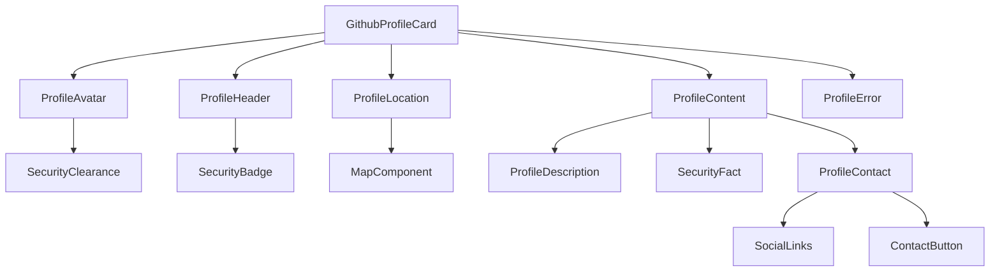

# GitHub Profile Card Refactoring Plan

## Component Structure

## Detailed Breakdown

### 1. Atomic Components

#### ProfileAvatar (`src/components/atoms/ProfileAvatar`)
- Handles profile image display
- Security clearance overlay
- Loading state skeleton
- Image lazy loading

#### SecurityBadge (`src/components/atoms/SecurityBadge`)
- Shield icon with title
- Reusable for other security-themed components

#### SecurityFact (`src/components/atoms/SecurityFact`)
- Terminal icon with fact display
- Random fact selection logic moved to parent

#### ContactButton (`src/components/atoms/ContactButton`)
- Rocket icon with contact text
- Email link functionality

### 2. Molecule Components

#### ProfileHeader (`src/components/molecules/ProfileHeader`)
- Combines SecurityBadge with title
- Handles header animations

#### ProfileLocation (`src/components/molecules/ProfileLocation`)
- Wraps MapComponent
- Handles location display logic

#### ProfileContent (`src/components/molecules/ProfileContent`)
- Description section
- SecurityFact integration
- Contact section with social links

#### ProfileError (`src/components/molecules/ProfileError`)
- Error state display
- Retry functionality
- Consistent error styling

### 3. Implementation Steps

#### Phase 1: Create Atomic Components
- Create base components with proper prop types
- Implement individual CSS modules
- Add unit tests for each component
- Create Storybook stories

#### Phase 2: Create Molecule Components
- Combine atomic components
- Implement animation logic
- Add integration tests
- Create Storybook stories

#### Phase 3: Refactor GithubProfileCard
- Replace existing code with new components
- Move animation logic to appropriate components
- Update tests and stories
- Ensure backward compatibility

### 4. Technical Considerations

#### Animation Strategy
- Use AnimationContext consistently
- Maintain stagger effects
- Keep spring animations for smooth transitions

#### Styling Approach
- CSS modules for component-specific styles
- Design tokens for consistent theming
- Maintain security-themed styling

#### Performance Optimization
- React.memo for pure components
- Lazy loading for images
- Proper prop drilling prevention

#### Accessibility
- ARIA labels for interactive elements
- Keyboard navigation support
- Color contrast compliance

### 5. Testing Strategy

#### Unit Tests
- Individual component testing
- Prop validation
- State management

#### Integration Tests
- Component interaction testing
- Animation testing
- Error handling

#### Storybook Stories
- Component documentation
- Visual regression testing
- Accessibility testing