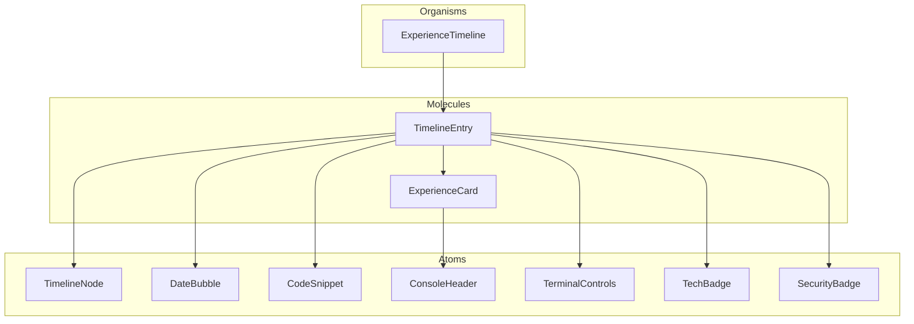

# Timeline Component System Guide

This guide provides an overview of the timeline component system used in the Experience section of the portfolio. It explains the architecture, component relationships, animation system, and usage patterns.

## Architecture Overview

The timeline component system is built using the Atomic Design methodology with a clear hierarchy:



## Component Responsibilities

### Organisms

- **ExperienceTimeline**: Container for all timeline entries. Handles loading states, error handling, and provides the `AnimationProvider` context. Renders decorative elements like secure connection nodes and binary patterns.

### Molecules

- **TimelineEntry**: Represents a single experience item in the timeline. Composes atomic components into a cohesive timeline entry with proper animations and layout.
- **ExperienceCard**: Displays detailed information about a specific experience, including company name, role, description, and bullet points.

### Atoms

- **TimelineNode**: Renders connection nodes in the timeline with optional interactive state.
- **DateBubble**: Displays year information with security level indicators.
- **CodeSnippet**: Renders code snippets with syntax highlighting for decorative purposes.
- **ConsoleHeader**: Displays a terminal-like header with command prompt.
- **TerminalControls**: Renders window control buttons (close, minimize, maximize) with variant support.
- **TechBadge**: Displays technology badges for skills used in each experience.
- **SecurityBadge**: Renders security verification status with ID for each timeline entry.

## Animation System

The timeline uses a centralized animation system through the `AnimationContext` and `useTimelineAnimation` hook:

1. **AnimationContext**: Provides global animation state management including:
   - Animation registration and triggering
   - Reduced motion preferences detection
   - Staggered animation delays
   - Visibility tracking

2. **useTimelineAnimation**: Custom hook for timeline entries that:
   - Manages intersection observer for scroll-based animations
   - Handles animation state and variants
   - Provides consistent animation interfaces
   - Generates security IDs and animations

## Usage Examples

### Basic Timeline Entry

```jsx
import TimelineEntry from '@molecules/TimelineEntry/TimelineEntry';

const experienceData = {
  company: "Example Corp",
  role: "Frontend Developer",
  date: "Jan 2022 - Present",
  desc: "Working on exciting projects",
  companylogo: "/images/logos/example.png",
  descBullets: ["Built responsive UI", "Implemented new features"]
};

function extractYear(date) {
  return date.split(" ")[0].split(" ")[1];
}

<TimelineEntry
  data={experienceData}
  index={0}
  extractDateYear={extractYear}
  variant="security"
  id="entry-1"
/>
```

### Complete Timeline

```jsx
import ExperienceTimeline from '@organisms/Experience/ExperienceTimeline';
import { useExperience } from '@hooks/useExperience';

const MyExperienceSection = () => {
  const { experience, isLoading, error, extractDateYear } = useExperience();
  
  return (
    <section id="experience">
      <h2>Experience</h2>
      <ExperienceTimeline
        experience={experience}
        extractDateYear={extractDateYear}
        variant="security"
        isLoading={isLoading}
        hasError={!!error}
      />
    </section>
  );
};
```

## Styling System

The timeline components use a consistent styling system with:

1. **CSS Variables**: Design tokens for colors, spacing, and typography
   ```css
   :root {
     --color-primary: #0078ff;
     --color-background: #121212;
     --spacing-4: 1rem;
     /* etc. */
   }
   ```

2. **Variants**: Each component supports different visual variants:
   - `security`: Cybersecurity-themed styling (default)
   - `terminal`: Terminal/console styling
   - (empty string): Default minimal styling

3. **Motion Considerations**: All animations respect user preferences:
   ```css
   @media (prefers-reduced-motion: reduce) {
     .timeline-entry {
       transition: none;
     }
   }
   ```

## Accessibility Features

The timeline components include several accessibility enhancements:

- Proper ARIA attributes for non-standard UI elements
- Screen reader support with meaningful labels
- Keyboard navigation support
- Focus management for interactive elements
- Reduced motion support
- Adequate color contrast

## Best Practices

When working with the timeline components:

1. **Use the AnimationProvider**: Always wrap timeline components with the AnimationProvider.
2. **Consistent Variants**: Use the same variant across all components in a timeline.
3. **Provide Meaningful IDs**: Use unique IDs for components to ensure proper animation tracking.
4. **Test with Reduced Motion**: Always verify components work with reduced motion enabled.
5. **Consider Mobile Views**: Timeline components should be responsive and work on small screens.

## Adding New Components

To add a new component to the timeline system:

1. Create the component following the atomic design pattern
2. Add proper TypeScript interface in `types/components.d.ts`
3. Add animation support using the useTimelineAnimation hook if needed
4. Create a Storybook story for documentation
5. Add unit tests for behavior and accessibility
6. Update this guide with relevant information

## TypeScript Conversion

The current components are in JSX format, but we're planning to convert them to TSX. When converting:

1. Add proper interfaces extending from types in `types/components.d.ts`
2. Use generics for reusable components
3. Add proper type narrowing for conditional rendering
4. Fix import paths to use TypeScript module paths
