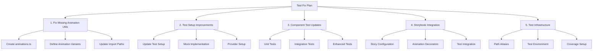

# Test Fix Plan

This document outlines the plan for fixing and improving the test suite in the Developer Portfolio project.

## Overview

## 1. Fix Missing Animation Utils

### Create animations.ts
- Create new file at `src/utils/animations.ts`
- Define animation variants (slideUpVariants, fadeInVariants, scaleVariants)
- Implement animation delay utility (getAnimationDelay)
- Define animation configuration constants

### Animation Variants
- Move animation-related utilities from AnimationContext.tsx
- Maintain separation of concerns between context and animations
- Ensure type safety with TypeScript definitions

### Import Path Updates
- Update all imports to use new animations module
- Fix path aliases in test setup
- Update component imports

## 2. Test Setup Improvements

### Test Setup File
- Update src/test/setup.ts with proper imports
- Improve mock implementations
- Add comprehensive type definitions
- Enhance provider setup for testing

### Mock Implementations
- Create proper mocks for:
  - Animation utilities
  - Context providers
  - Browser APIs
  - Performance monitoring

### Provider Setup
- Implement proper context providers
- Add animation context setup
- Configure portfolio context for tests

## 3. Component Test Updates

### Unit Tests
- Update test patterns for components
- Add animation-specific test cases
- Implement proper mocking strategies
- Test component rendering and behavior

### Integration Tests
- Test component interactions
- Verify animation behaviors
- Test context integration
- Ensure proper state management

### Enhanced Tests
- Add animation-specific test cases
- Test accessibility during animations
- Test performance optimizations
- Verify complex interactions

## 4. Storybook Integration

### Story Configuration
- Update story configurations
- Add animation controls
- Implement proper decorators
- Configure test environment

### Animation Testing
- Test animation states
- Add visual regression tests
- Verify animation behaviors
- Test performance impact

### Test Integration
- Integrate with component tests
- Add visual regression testing
- Test animation states
- Verify story configurations

## 5. Test Infrastructure

### Path Aliases
- Configure proper path resolution
- Update TypeScript configuration
- Fix import aliases
- Ensure consistent usage

### Test Environment
- Configure proper test environment
- Set up mocking system
- Configure coverage reporting
- Add performance monitoring

### Coverage Setup
- Configure coverage thresholds
- Set up reporting
- Track coverage metrics
- Implement coverage gates

## Implementation Phases

### Phase 1: Critical Fix
1. Create animations.ts
2. Update test setup
3. Fix path aliases

### Phase 2: Component Tests
1. Update component tests
2. Add animation test cases
3. Fix integration tests

### Phase 3: Infrastructure
1. Improve test environment
2. Add coverage reporting
3. Update documentation

### Phase 4: Storybook
1. Update story configurations
2. Add animation controls
3. Implement visual testing

## Success Criteria

- All tests passing
- No import errors
- Proper animation testing
- Comprehensive coverage
- Clear documentation
- Maintainable test suite