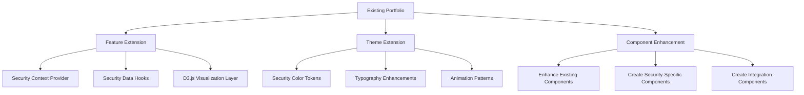

# Security Portfolio Implementation Roadmap

This document extends our security portfolio design plan and component checklist with a comprehensive implementation roadmap, focusing on integration with the existing portfolio, detailed milestones, testing strategy, and risk management.

## Integration with Existing Portfolio Architecture

### Current Portfolio Integration Points

| Current Component | Security Enhancement | Integration Strategy |
|-------------------|----------------------|---------------------|
| **PortfolioContext** | Extend with security domain data | Add security-specific state without modifying existing data structure |
| **Navigation** | Security-themed navigation | Create theme extension rather than replacement |
| **ProjectsCard** | Security project showcase | Extend with security metadata fields, use existing card structure |
| **SkillsSection** | Security domain radar chart | Create alternative view toggle between current and security visualization |
| **ExperienceSection** | Security milestone timeline | Add security categorization to existing timeline items |
| **Tailwind Configuration** | Security color palette | Extend existing theme with security colors without replacing |

### Architecture Enhancement Strategy



1. **Component Reuse Strategy**
   - Extend rather than replace core components
   - Use composition pattern to wrap existing components with security enhancements
   - Create adapter components for connecting existing data structures to new visualizations

2. **Theme Consistency Approach**
   - Implement security theme as a theme extension, not replacement
   - Allow toggling between standard and security-focused themes
   - Ensure all security-specific components degrade gracefully in standard theme

3. **Data Flow Integration**
   - Extend portfolio.js data structure with security-specific fields
   - Create transformation layer between existing data and visualization requirements
   - Implement adapter hooks that connect to both data sources

## Detailed Implementation Tasks

### Phase 1: Foundation

#### 1.1: Environment & Theme Setup
| Priority | Task | Output | Dependencies | Owner |
|-----|------|--------|--------------|-------|
| 1 | - [ ] Initial D3.js dependency installation | Updated package.json | None | Engineer |
| 1 | - [ ] Security token integration in Tailwind | Updated tailwind.config.cjs | None | Engineer |
| 2 | - [ ] Create D3.js utility modules | `src/utils/d3/` directory with base utilities | D3.js installation | Engineer |
| 3 | - [ ] Setup security theme toggles | Theme switching capability | Tailwind config | Engineer |
| 4 | - [ ] Create component stubs for all atoms | Empty component files following checklist | Component generator | Engineer |
| 5 | - [ ] Setup storybook category for security components | Updated storybook configuration | Storybook | Engineer |

#### 1.2: Base Component Development
| Priority | Task | Output | Dependencies | Owner |
|-----|------|--------|--------------|-------|
| 1 | - [ ] Implement SecurityIcon atom | Fully functional component with tests | None | Engineer |
| 2 | - [ ] Implement SecurityBadge atom | Fully functional component with tests | None | Engineer |
| 3 | - [ ] Implement D3Container atom | Base container for all D3 visualizations | D3.js utilities | Engineer |
| 4 | - [ ] Implement CodeBlock atom | Syntax highlighting component | prism-react-renderer | Engineer |
| 5 | - [ ] Integration testing of base atoms | Test reports | All atoms | QA Engineer |

### Phase 2: Core Visualizations

#### 2.1: Data Context & Basic Visualizations
| Priority | Task | Output | Dependencies | Owner |
|-----|------|--------|--------------|-------|
| 1 | - [ ] Create SecurityDataContext | Context provider with mock data | None | Engineer |
| 2 | - [ ] Implement useSecurityDomains hook | Custom hook for domain data | SecurityDataContext | Engineer |
| 3 | - [ ] Create SecurityRadarChart | Core D3.js radar chart component | D3Container, D3 utilities | Engineer |

#### 2.2: Network & Geo Visualizations
| Priority | Task | Output | Dependencies | Owner |
|-----|------|--------|--------------|-------|
| 1 | - [ ] Implement NetworkGraph | Force-directed graph for K8s architecture | D3Container, d3-force | Engineer |
| 2 | - [ ] Implement GeoThreatMap | World map with attack visualization | D3Container, d3-geo, topojson | Engineer |

#### 2.3: Molecule Components
| Priority | Task | Output | Dependencies | Owner |
|-----|------|--------|--------------|-------|
| 1 | - [ ] Create SecurityCertificationBadge | Certification display component | SecurityBadge | Engineer |
| 2 | - [ ] Create KubernetesObjectCard | K8s resource visualization | CodeBlock | Engineer |
| 3 | - [ ] Create SecurityMetricsCard | Metrics display for dashboard | MetricCounter | Engineer |
| 4 | - [ ] Integration testing of visualization components | Test reports | All molecules | QA Engineer |

### Phase 3: Section Development

#### 3.1: Hero & Expertise Sections
| Priority | Task | Output | Dependencies | Owner |
|-----|------|--------|--------------|-------|
| 1 | - [ ] Implement SecurityHeroSection | Hero section with animations | Terminal, MetricCounter | Engineer |
| 2 | - [ ] Implement SecurityDomainExpertiseSection | Domain expertise section | SecurityRadarChart, SecurityCertificationBadge | Engineer |

#### 3.2: Kubernetes & Project Sections
| Priority | Task | Output | Dependencies | Owner |
|-----|------|--------|--------------|-------|
| 1 | - [ ] Implement KubernetesExpertiseSection | K8s expertise showcase section | NetworkGraph, KubernetesObjectCard | Engineer |
| 2 | - [ ] Extend Project Gallery for security | Security-focused project display | Existing ProjectsCard | Engineer |

#### 3.3: Pipeline & Dashboard Sections
| Priority | Task | Output | Dependencies | Owner |
|-----|------|--------|--------------|-------|
| 1 | - [ ] Implement DevSecOpsPipeline | Interactive pipeline visualization | All required atoms & molecules | Engineer |
| 2 | - [ ] Implement ThreatIntelligenceDashboard | Real-time security dashboard | GeoThreatMap, SecurityMetricsCard | Engineer |
| 3 | - [ ] User testing of all sections | Feedback report | All sections | QA Engineer |

### Phase 4: Integration & Refinement

#### 4.1: Data Integration & Layout
| Priority | Task | Output | Dependencies | Owner |
|-----|------|--------|--------------|-------|
| 1 | - [ ] Create real data connectors | Live API integrations | All data hooks | Engineer |
| 2 | - [ ] Implement SecurityPortfolioLayout | Complete page layout | All sections | Engineer |
| 3 | - [ ] Create theme toggle mechanism | Ability to switch between standard/security themes | Tailwind configuration | Engineer |

#### 4.2: Performance & Accessibility
| Priority | Task | Output | Dependencies | Owner |
|-----|------|--------|--------------|-------|
| 1 | - [ ] Performance optimization | Improved Lighthouse scores | All components | Engineer |
| 2 | - [ ] Accessibility improvements | WCAG compliance | All components | Engineer |
| 3 | - [ ] Animation refinement | Polished micro-interactions | All components | Engineer |
| 4 | - [ ] Final integration testing | Comprehensive test report | Complete portfolio | QA Engineer |

## Dependency Management Strategy

### Core D3.js Dependencies

For efficient dependency management, we'll use a phased approach to adding D3.js libraries:

```
// Phase 1: Core visualization
- [ ] yarn add d3

// Phase 2.1: Network visualization
- [ ] yarn add d3-force d3-hierarchy

// Phase 2.2: Geographic visualization
- [ ] yarn add d3-geo topojson-client d3-scale-chromatic

// Phase 2.3: React integration
- [ ] yarn add @visx/visx
```

### Progressive Enhancement of Component Generator

We'll enhance the component generator script to better support D3.js visualizations:

1. **Phase 1.1: Script Extension**
   - [ ] Add D3.js component template with SVG setup
   - [ ] Include D3 hook template with useEffect pattern
   - [ ] Add accessibility boilerplate for data visualizations

```javascript
// D3 Component Template Addition for generate-component.js
// To be added in Phase 1

// D3 Component Template
if (componentType === 'd3') {
  template = `import React, { useRef, useEffect${config.memoize ? ', memo' : ''} } from 'react';
${config.addPropTypes ? "import PropTypes from 'prop-types';" : ""}
${cssImportPath}
import * as d3 from 'd3';

${config.addJsDoc ? `/**
 * ${componentName} visualization component
 * 
 * @component
 * @param {Object} props - Component props
 * @returns {React.ReactElement} ${componentName} component
 */` : ""}
const ${componentName} = (props) => {
  const { 
    data,
    width = 500,
    height = 500,
    margin = { top: 20, right: 20, bottom: 30, left: 40 },
    className = '',
    ariaLabel = '${componentName} visualization',
    ...rest 
  } = props;
  
  const svgRef = useRef(null);
  
  useEffect(() => {
    if (!data || !svgRef.current) return;
    
    const svg = d3.select(svgRef.current);
    
    // Clear previous visualization
    svg.selectAll('*').remove();
    
    // Setup visualization
    const contentWidth = width - margin.left - margin.right;
    const contentHeight = height - margin.top - margin.bottom;
    
    const g = svg
      .append('g')
      .attr('transform', \`translate(\${margin.left},\${margin.top})\`);
    
    // TODO: Implement visualization using D3.js
    // Example: create scales, axes, and visualization elements
    
  }, [data, width, height, margin]);
  
  return (
    <div 
      className={\`${componentName.toLowerCase()} \${className}\`} 
      {...rest}
    >
      <svg
        ref={svgRef}
        width={width}
        height={height}
        aria-label={ariaLabel}
      >
        <title>{ariaLabel}</title>
        <desc>${componentName} visualization of the provided data</desc>
      </svg>
    </div>
  );
};

${config.addPropTypes ? `${componentName}.propTypes = {
  /** Data for the visualization */
  data: PropTypes.array.isRequired,
  /** Width of the SVG container */
  width: PropTypes.number,
  /** Height of the SVG container */
  height: PropTypes.number,
  /** Margins for the visualization */
  margin: PropTypes.shape({
    top: PropTypes.number,
    right: PropTypes.number,
    bottom: PropTypes.number,
    left: PropTypes.number,
  }),
  /** Additional CSS class names */
  className: PropTypes.string,
  /** Accessibility label for the chart */
  ariaLabel: PropTypes.string,
};` : ""}

${config.memoize ? `// Apply memoization for performance optimization
export default memo(${componentName});` : `export default ${componentName};`}
`;
}
```

2. **Phase 1.2: Code Snippets**
   - [ ] Create code snippets library for common D3 patterns
   - [ ] Develop helper functions for typical security visualizations
   - [ ] Document D3 integration patterns for developers

## Technical Debt Prevention

To avoid introducing technical debt during this enhancement:

1. **Code Quality Gates**
   - [ ] ESLint rules specific to D3.js best practices
   - [ ] Performance budgets for visualization components
   - [ ] Accessibility requirements for data visualizations

2. **Documentation Requirements**
   - All security components must have:
     - [ ] Comprehensive JSDoc comments
     - [ ] Storybook stories with examples
     - [ ] Accessibility notes
     - [ ] Performance considerations

3. **Testing Matrix**

| Component Type | Unit Tests | Integration Tests | Visual Regression | Accessibility | Performance |
|----------------|------------|-------------------|-------------------|--------------|-------------|
| Atoms | ✅ | ✅ | ✅ | ✅ | ✅ |
| D3 Visualizations | ✅ | ✅ | ✅ | ✅ | ✅ |
| Complex Organisms | ✅ | ✅ | ✅ | ✅ | ✅ |
| Sections | ❌ | ✅ | ✅ | ✅ | ✅ |
| Full Layout | ❌ | ✅ | ✅ | ✅ | ✅ |

## Risk Management

### Identified Risks & Mitigation Strategies

| Risk | Impact | Probability | Mitigation Strategy |
|------|--------|------------|---------------------|
| D3.js performance issues with large datasets | High | Medium | - [ ] Implement WebWorkers for data processing<br>- [ ] Implement virtualization for large datasets |
| React/D3 integration complications | Medium | High | - [ ] Create reusable integration patterns early<br>- [ ] Test thoroughly |
| Browser compatibility issues with SVG | Medium | Medium | - [ ] Implement feature detection<br>- [ ] Create graceful degradation paths |
| Data API availability | High | Low | - [ ] Create robust offline fallbacks with mock data |
| Animation performance on mobile | Medium | Medium | - [ ] Implement reduced motion for mobile<br>- [ ] Test on various devices |
| Component bloat affecting load times | High | Medium | - [ ] Implement aggressive code splitting<br>- [ ] Add lazy loading for visualizations |

### Fallback Plan

For each major component, we'll implement a fallback strategy:

1. **Visualization Components**
   - [ ] Static image fallback for SVG rendering issues
   - [ ] Tabular data view as alternative to graphical
   - [ ] Text-based summaries for screen readers and low-bandwidth

2. **Real-time Data**
   - [ ] Cached data display when real-time unavailable
   - [ ] Last-updated timestamp disclosure
   - [ ] Manual refresh button for user control

3. **Complex Interactions**
   - [ ] Simplified interactions for older browsers
   - [ ] Keyboard-accessible alternatives for all features
   - [ ] Progressive enhancement approach

## User Testing & Validation Plan

### Testing Phases

1. **Early Prototype Testing (Phase 2.1)**
   - [ ] Static mockups of security visualizations
   - [ ] User interviews for concept validation
   - [ ] Accessibility expert review

2. **Component Testing (Phase 2.3)**
   - [ ] Usability testing of individual visualizations
   - [ ] A/B testing of interaction patterns
   - [ ] Performance benchmarking

3. **Integration Testing (Phase 3.3)**
   - [ ] End-to-end user flows
   - [ ] Cross-browser compatibility
   - [ ] Mobile responsiveness

4. **Final Validation (Phase 4.2)**
   - [ ] Full portfolio user testing
   - [ ] Lighthouse performance audits
   - [ ] Accessibility compliance verification

### Test User Profiles

1. **Security Professionals**
   - Evaluate technical accuracy of visualizations
   - Validate security concept representations
   - Assess professional credibility

2. **Technical Recruiters**
   - Evaluate effectiveness at showcasing skills
   - Measure information retrieval efficiency
   - Test overall impression and memorability

3. **General Audiences**
   - Test comprehension of technical concepts
   - Evaluate visual appeal and engagement
   - Measure loading times and performance perception

## Continuous Improvement Plan

After initial implementation, we'll establish:

1. **Metrics Collection**
   - [ ] Component-level performance tracking
   - [ ] User interaction analytics
   - [ ] Error and issue logging

2. **Feedback Mechanisms**
   - [ ] Direct feedback collection on portfolio
   - [ ] Regular user testing sessions
   - [ ] A/B testing of new visualization approaches

3. **Iteration Cadence**
   - [ ] Scheduled performance optimizations
   - [ ] Regular feature enhancements
   - [ ] Periodic major visualization updates

## Deliverables Checklist

### Phase 1 Deliverables
- [ ] Complete set of atomic components
- [ ] D3.js utility library
- [ ] Security theme integration
- [ ] Component storybook documentation

### Phase 2 Deliverables
- [ ] Core visualization components
- [ ] Security data context and hooks
- [ ] Mock data service with realistic security data
- [ ] Interactive component prototypes

### Phase 3 Deliverables
- [ ] All major section components
- [ ] Integration with existing portfolio
- [ ] Real-time data connections
- [ ] User testing feedback

### Phase 4 Deliverables
- [ ] Complete security-focused portfolio
- [ ] Performance optimization report
- [ ] Accessibility compliance documentation
- [ ] Future enhancement roadmap

## Extended Application Areas

Beyond the core implementation, we've identified these potential extension areas:

1. **Security Blog Integration**
   - Dynamic content system for security articles
   - Code snippet showcase with live editing
   - Security news aggregation

2. **Interactive Security Challenges**
   - Embedded CTF-style challenges
   - Code review exercises
   - Security quiz with scoring

3. **Certification Verification System**
   - Blockchain-based verification
   - QR codes for credential checking
   - Timeline of continuous learning

4. **Collaboration Features**
   - Security project contribution invitations
   - Secure contact form with encryption
   - Scheduled security consultation booking

These extensions would be considered for Phase 2 development after the core security portfolio implementation is complete.
